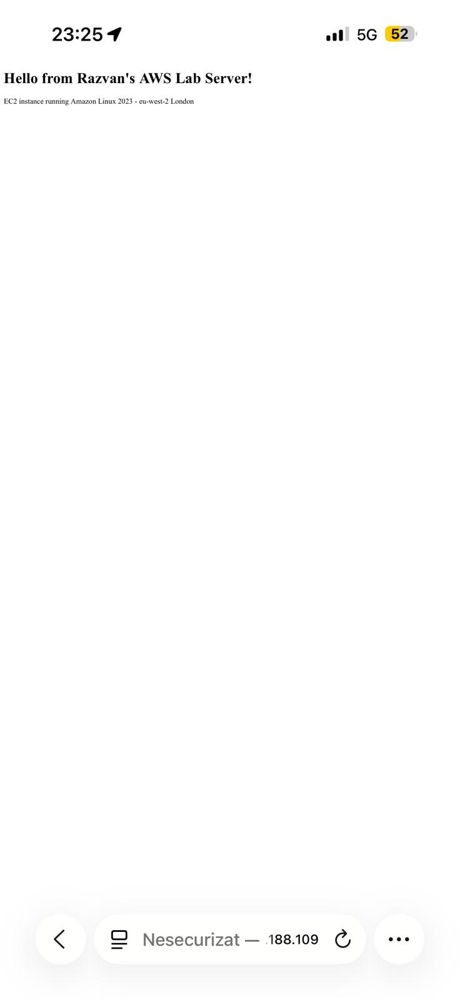
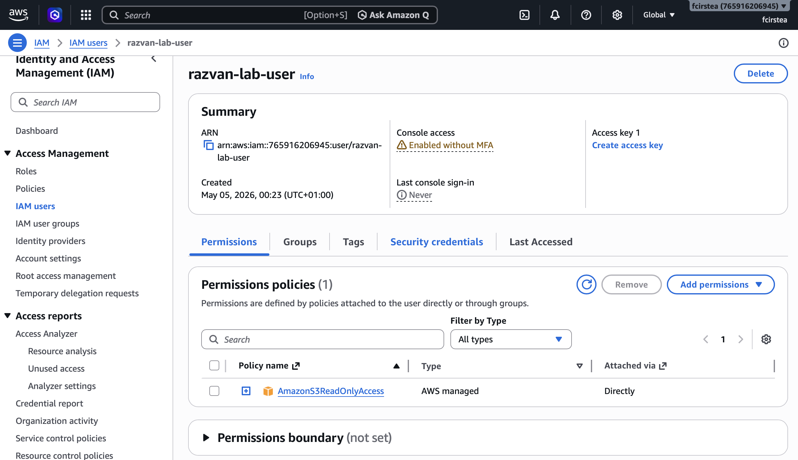
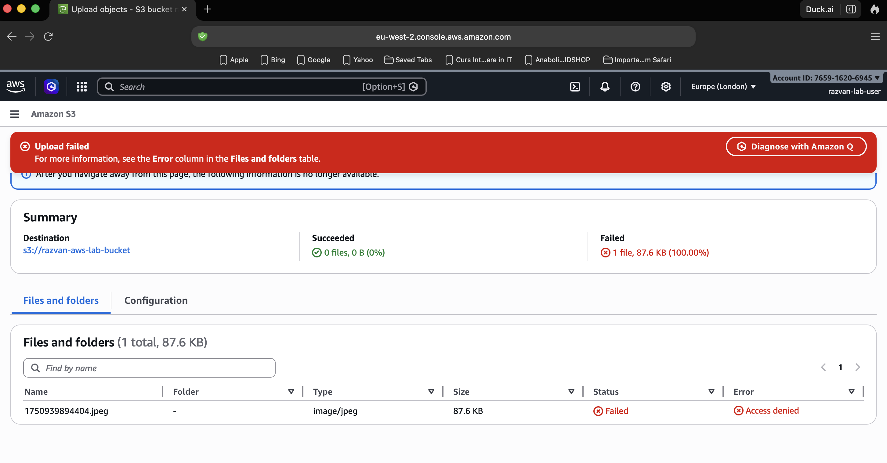
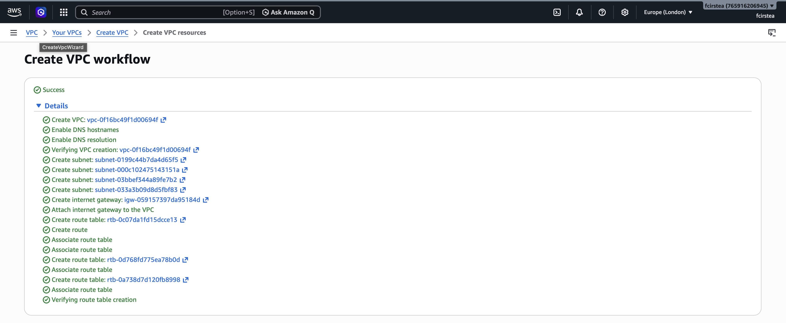
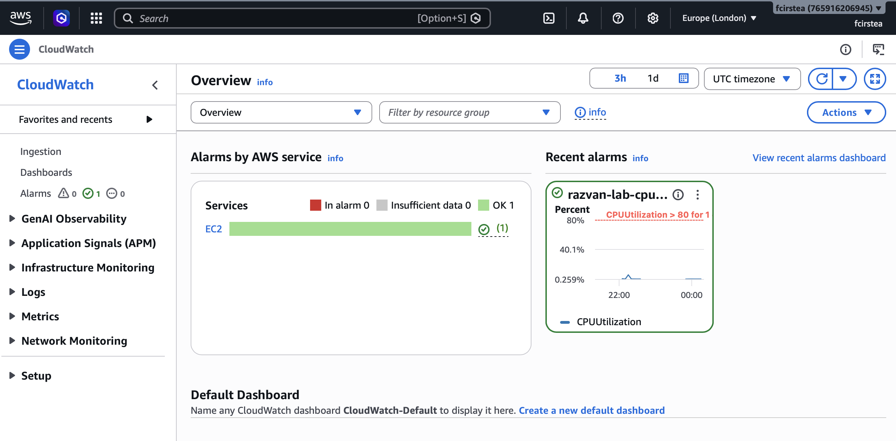

# AWS Home Lab - Razvan Cirstea

Hands-on AWS projects built while studying for AWS Cloud Practitioner and Solutions Architect Associate certifications.

---

## Project 1 - EC2 Web Server ✅

**What I did:**
- Launched an EC2 t3.micro instance on AWS (eu-west-2 London)
- Configured Security Group with SSH, HTTP, and HTTPS rules
- Connected to the instance via SSH using RSA key pair
- Installed and configured Apache HTTP Server (httpd)
- Hosted a live webpage accessible via public IP

**Skills demonstrated:** EC2, Security Groups, SSH, Linux CLI, Apache

**Live proof:**

## Project 2 - S3 Storage & Permissions ✅

**What I did:**
- Created an S3 bucket in eu-west-2 London
- Configured ACLs and public access settings
- Uploaded a file and made it publicly accessible via Object URL
- Understood S3 permissions model (private vs public-read)

**Skills demonstrated:** S3, ACLs, Bucket Policies, Public Access settings

**Live proof:**
- [S3 Object URL](https://razvan-aws-lab-bucket.s3.eu-west-2.amazonaws.com/osi-model-7-layers-1.png)

## Project 3 - IAM Users & Policies ✅

**What I did:**
- Created an IAM user (razvan-lab-user) in AWS Console
- Attached AmazonS3ReadOnlyAccess policy
- Tested Least Privilege principle — user could read S3 but not write
- Understood difference between IAM users, policies, and permissions

**Skills demonstrated:** IAM, Users, Policies, Least Privilege, AWS Security

**Live proof:**

## Project 4 - VPC with Public & Private Subnets ✅

**What I did:**
- Created a custom VPC with CIDR block 10.0.0.0/16
- Configured 2 public subnets and 2 private subnets
- Set up Route Tables and Internet Gateway
- Enabled DNS hostnames and DNS resolution

**Skills demonstrated:** VPC, Subnets, Route Tables, Internet Gateway, Network Architecture

**Live proof:**

## Project 5 - CloudWatch Monitoring ✅

**What I did:**
- Created a CloudWatch alarm monitoring EC2 CPU utilization
- Set threshold at 80% CPU usage
- Configured SNS notification topic for email alerts
- Understood AWS monitoring and alerting best practices

**Skills demonstrated:** CloudWatch, Alarms, SNS, EC2 Monitoring, AWS Observability

**Live proof:**

